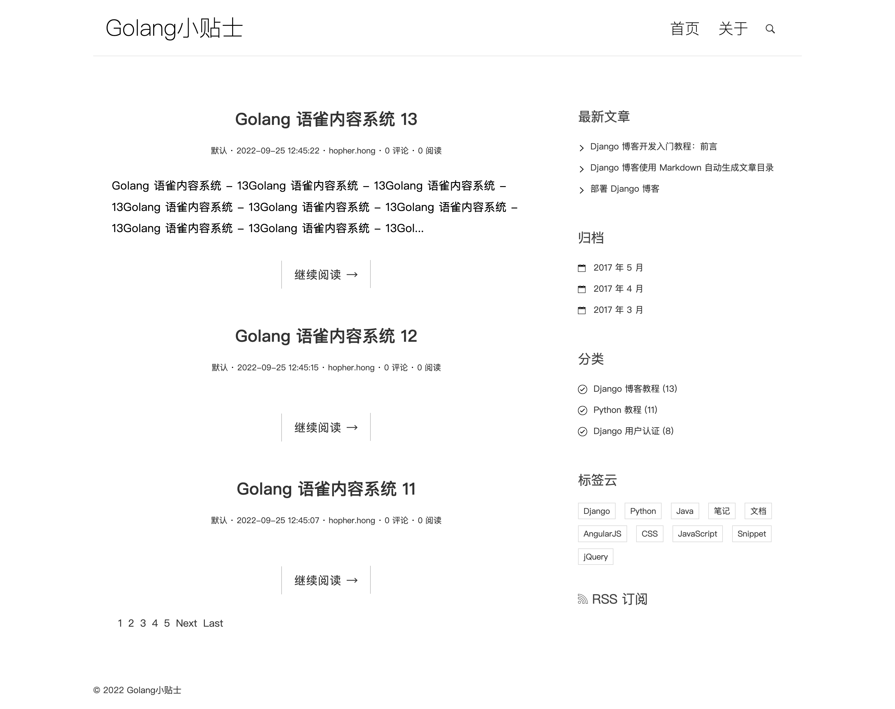
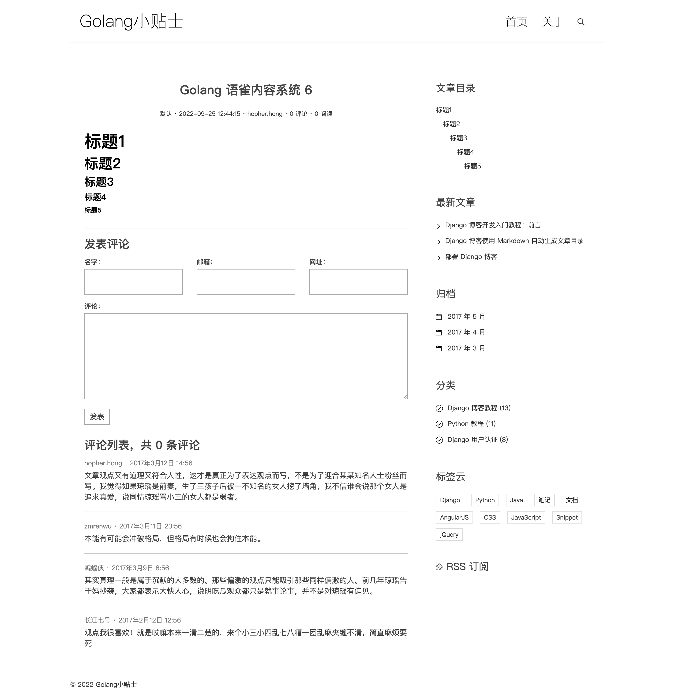

# Golang 语雀内容系统

基于语雀文档开放接口，使用golang构建独立域名内容系统

- [Github](https://github.com/golangtips/yuque)
- [演示地址](http://golangtips.com)

## 功能

* 解决语雀的防盗链图片加载失败
* 列表页/详情页，做了缓存处理，减少语雀API调用，加快访问速度
* 语雀的文章搜索很难用，实现了倒排索引提供精确的全文检索功能。

## TODO

* 实现评论功能

## 截图

## License

The MIT License

# 参考
- [语雀开放文档](https://www.yuque.com/yuque/developer/api)